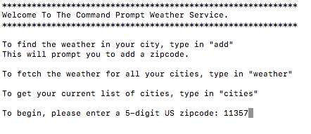

# Weather in C#

Weather is a small console based weather application written in C#.  Weather data is retrieved through a `HTTP` request to [Weather Underground][link].

[link]: https://www.wunderground.com/  

## Libraries

Weather in C# uses these libraries:
* `System.IO`
* `System.Net`
* `System.Text`
* `System.Collections.Generic`
* `Newtonsoft.Json`

In this application, `System.Collections.Generic` is used to leverage the `List` data structure.
For the  `HTTP` request, `System.Net` is used to create `HttpWebResponse`.
To handle the `JSON` response from the `HTTP` request, `Newtonsoft.Json` was used for `DeserializeObject`.

## How It Works

This terminal application is built with Object Oriented Principles in mind.  
The application begins by prompting the user to add a zip code.



This creates an instance of City class to store and request the weather data.  To properly deserialize the JSON coming in from the `HTTP` Request, a custom `Forcast` was created to store the needed variables.

```csharp
class Forcast
{
  public class DisplayLocation
  {
    public string full { get; set; }
  }

  public class CurrentObservation
  {
    public DisplayLocation display_location { get; set; }
    public string temperature_string { get; set; }
  }

  public class RootObject
  {
    public CurrentObservation current_observation { get; set; }
  }
}
```

Using the `Forcast` class, data can be stored in the `City` instance to print out data.


